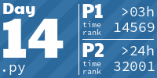

# Advent Of Code

This repo is the place I save every single code for the famous challenge [Advent Of Code](https://adventofcode.com)

It will be public at any time of the year, except from the 1st to the 25th of december of any year!

<!-- AOC TILES BEGIN -->
<h1 align="center">
  Advent of Code - 236/522 ⭐
</h1>
<h1 align="center">
  2025 - 22 ⭐ - Python
</h1>

<h1 align="center">
  2024 - 47 ⭐ - Python
</h1>

<h1 align="center">
  2023 - 40 ⭐ - Python
</h1>

<h1 align="center">
  2022 - 45 ⭐ - Python
</h1>

<h1 align="center">
  2021 - 42 ⭐ - Python
</h1>

<h1 align="center">
  2020 - 28 ⭐ - Python
</h1>

<h1 align="center">
  2015 - 12 ⭐ - Python
</h1>

<!-- AOC TILES END -->
